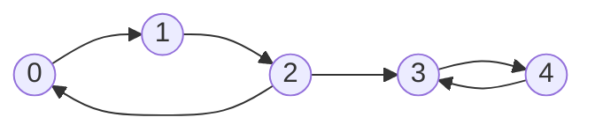
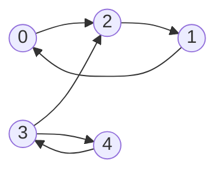

**Конденсированный граф** — граф, получаемый из орграфа, сжатием компонент сильной связности в одну вершину

![[Pasted image 20260214140853.png]]

___
### Алгоритм Косарайю
Предназначен для поиска компонент сильной связности в орграфе

1. **Прямой обход $DFS$ и построение топологического порядка**
	Когда $DFS$ выходит из вершины, мы добавляем её в список (стек) `orders`
2. **Транспонирование рёбер**
	Создаём новый граф, где каждое ребро $u \to v$ заменяется на $v \to u$.
3. **Обратный обход $DFS$**
	Берём вершины из нашего списка `orders` в обратном порядке (с конца) и запускаем $DFS$ по транспонированному графу

**Асимптотика:** $O(|V| + |E|)$

___
#### Пример



- **Компонента 1:** 0, 1, 2 ($0 \to 1 \to 2 \to 0$)
- **Компонента 2:** 3, 4 ($3 \to 4 \to 3$)

**Шаг 1:** Запускаем DFS от вершины $0$: `orders = [4, 3, 2, 1, 0]`
**Шаг 2**: Разворачиваем все стрелки. Теперь компоненты внутри остались связными, но мост между ними теперь ведет из **3 в 2**.



**Шаг 3:** Обратный DFS
- **Запуск из 0:**
    
    - Посещаем 0, идем по стрелкам: $0 \to 2 \to 1$.
        
    - Все, тупик (в 3 зайти нельзя, стрелка $3 \to 2$ мешает).
        
    - **SCC 1:** `{0, 1, 2}`.
        
- **Запуск из 1 и 2:** Пропускаем, так как `mark[1]` и `mark[2]` уже истинны.
    
- **Запуск из 3:**
    
    - Посещаем 3, идем в 4.
        
    - Из 4 в 3 (уже посещена), из 3 в 2 (уже посещена).
        
    - **SCC 2:** `{3, 4}`.
        
- **Запуск из 4:** Пропускаем.

___

#### Доказательство корректности

Пусть
- $G = (V, E)$ — ориентированный граф.
- $SCC(G) = \{C_1, C_2, \dots, C_k\}$ — множество его сильно связанных компонент.
- $G^{SCC} = (V^{SCC}, E^{SCC})$ — граф конденсации (где вершины — это $C_i$, а ребра — связи между компонентами). Это всегда **ациклический граф** (иначе получаем, что совокупность всех компонент - тоже сильно связная компонента)

##### 1. Определение времени выхода ($finish[v]$)

Для компоненты $C_i$ определим время выхода $f(C_i) = \max_{v \in C_i} (finish[v])$.

##### 2. Свойство первого $DFS$ (прямого)

Если в графе конденсации $G^{SCC}$ есть ребро из $C_i$ в $C_j$ ($C_i \to C_j$), то $f(C_i) > f(C_j)$.
_То есть, компоненты-истоки (в смысле $G^{SCC}$) имеют большее время выхода, чем компоненты-стоки._

##### 3. Порядок в стеке `orders`

Стек `orders` содержит вершины в порядке **возрастания** времени выхода.
Следовательно, вершины компоненты с **максимальным** $f(C)$ находятся на **вершине** стека.

##### 4. Влияние транспонирования ($G^T$)

Пусть $G^T = (V, E^T)$ — граф с развернутыми ребрами.
Если в $G^{SCC}$ было ребро $C_i \to C_j$, то в $G^{SCC, T}$ ребро поменяло направление: $C_j \to C_i$.

_То есть, $G^T$ меняет роли истоков и стоков в конденсации._

##### 5. Корректность второго $DFS$ (обратного)

Пусть мы берем вершину $v$ из стека `orders`. Пусть $v \in C_{top}$, где $C_{top}$ — компонента с максимальным $f(C)$ среди еще не посещенных.

Запускаем $DFS2(v)$ в графе $G^T$.

1. **Компонента замкнута**: $DFS2$ достигнет всех вершин $u \in C_{top}$, так как они сильно связаны внутри $C_{top}$ (транспонирование сохраняет SCC).
    
2. **Нет утечки**: $DFS2$ не выйдет за пределы $C_{top}$.
    
    - Если есть ребро $C_{top} \to C_j$ в $G^{SCC}$, то в $G^T$ оно превращается в $C_j \to C_{top}$.
        
    - $DFS2$ идет _вдоль_ ребер $G^T$. Из $C_{top}$ он может уйти только в те компоненты, из которых в оригинале вел путь _в_ $C_{top}$. Но $C_{top}$ — это исток в оригинале ($G^{SCC}$), значит, в оригинале путей _в_ $C_{top}$ из других компонентов не было.
        
    - _Формально_: $DFS2(v)$ посетит только те вершины $u$, для которых существует путь $v \to u$ в $G^T$. Если $v \in C_{top}$, то этот путь не может выйти за пределы $C_{top}$, иначе бы $f(C_{top})$ не было максимальным.

___
#### Код

```cpp
void dfs1(int v) {
    visited[v] = true;
    for (int to : g[v])
        if (!visited[to]) dfs1(to);
    orders.push_back(v);
}

void dfs2(int v) {
    visited[v] = true;
    component.push_back(v);
    for (int to : gr[v])
        if (!visited[to]) dfs2(to);
}

int main() {
	...
    visited.assign(n, false);
    for (int i = 0; i < n; ++i) {
	    if (!visited[i]) { 
		    dfs1(i); 
	    } 
	}
	
	inverseGraph();
	reverse(orders.begin(), orders.end());
	visited.assign(n, false);
    
    for (int v : orders) {
        if (!visited[v]) {
            component.clear();
            dfs2(v);
            components.push_back(component);
        }
    }
}
```
