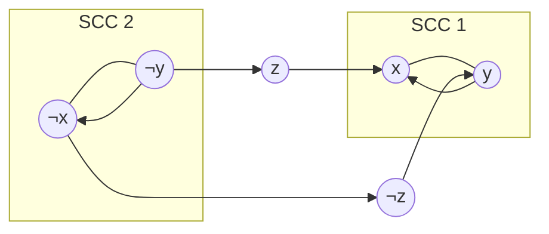

Это задача нахождения набора булевых значений для переменных, при которых вся логическая формула в форме КНФ становится истинной, при условии, что каждая скобка (дизъюнкт) содержит ровно **две** переменные.

#### 1. Построение графа импликаций

Каждый дизъюнкт $(a \lor b)$ эквивалентен двум импликациям:

- $\bar{a} \to b$
    
- $\bar{b} \to a$
    

Для данной формулы мы строим орграф, где $(a, b) \in E \iff a\to b$

#### 2. Поиск компонент сильной связности (SCC)

Используем алгоритм Косарайю

- **Зачем:** Если в графе есть путь $u \to v$, это значит, что при $u=1$ обязательно должно быть $v=1$.
    
- Если $u$ и $v$ в одной компоненте, они логически эквивалентны ($u \iff v$).
    

#### 3. Проверка на непротиворечивость

Формула **невыполнима**, если для любой переменной $x_i$:

$$idx(x_i) == idx(\bar{x}_i),$$

где $idx$ — номер компоненты связности. Если переменная и её отрицание лежат в одном цикле/SCC, мы получаем противоречие $x \to \bar{x}$ и $\bar{x} \to x$.

#### 4. Построение ответа

Если решение существует, значения выбираются на основе топологического порядка компонент.

> **Правило:** Мы хотим избежать ситуации, когда мы выбираем «Истину» для вершины, из которой достижима «Ложь». В графе конденсации это означает, что мы должны выбирать значения с конца (от стоков к истокам).

В алгоритме Косарайю компоненты нумеруются в порядке, **обратном** топологическому. Поэтому:

- Если $idx(x) > idx(\bar{x})$, то **$x = 1$** ($\bar{x}$ стоит раньше $x$)
- Если $idx(x) < idx(\bar{x})$, то **$x = 0$**

**Асимптотика:** $O(|V| + |E|)$
- $|V| = 2n$, где $n$ — количество переменных
- $|E| = 2m$, где $m$ — количество дизъюнктов

---

#### Пример

$$(x \lor \bar{y}) \land (y \lor z) \land (\bar{z} \lor x) \land (\bar{x} \lor y)$$

**Импликации:**

1. $\bar{x} \to \bar{y}, \quad y \to x$
    
2. $\bar{y} \to z, \quad \bar{z} \to y$
    
3. $z \to x, \quad \bar{x} \to \bar{z}$
    
4. $x \to y, \quad \bar{y} \to \bar{x}$
    

**SCC:**

- **Компонента 1:** $\{x, y\}$
- **Компонента 2:** $\{\bar{x}, \bar{y}\}$
- **Компонента 3:** $\{z\}$
- **Компонента 4:** $\{\bar{z}\}$

**Результат:**

1. **Проверка:** Ни в одной SCC нет одновременно переменной и её отрицания. Решение есть
    
2. По правилу $idx(v) > idx(\bar{v}) \implies v=1$:
	
	- $idx(x) > idx(\bar{x}) \implies \mathbf{x=1}$
	    
	- $idx(y) > idx(\bar{y}) \implies \mathbf{y=1}$
	    
	- $idx(z) > idx(\bar{z}) \implies \mathbf{z=1}$
	    
	
	Набор **$x=1, y=1, z=1$** удовлетворяет всем скобкам.