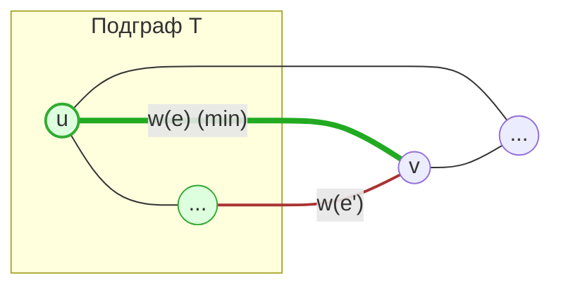

- **Остовной подграф** ($H$): Подграф графа $G(V, E)$, такой что множество его вершин совпадает с множеством вершин исходного графа: $V(H) = V$.
    
- **Остовное дерево**: Остовной подграф, являющийся деревом (связный граф без циклов).
    
- **Весовая функция**: $w: E \to \mathbb{R}$, сопоставляющая каждому ребру вещественное число (вес).
    
- **MST (Minimum Spanning Tree / Минимальное остовное дерево)**:  остовное дерево, суммарный вес рёбер которого минимален среди всех возможных остовных деревьев данного графа.
    

*Далее рассматриваем только неориентированные графы*

---

> [!INFO] **Лемма о безопасном ребре**
> 
> Если текущее множество рёбер $T$ является подмножеством некоторого MST, и мы выбираем ребро $e$ с минимальным весом, которое соединяет компоненту $T$ с вершиной вне этой компоненты (не создавая цикла), то $T \cup \{e\}$ также является подмножеством некоторого MST.

**Доказательство:**

- Пусть $T$ — подграф некоторого $MST_1$. При этом:

	- **$MST_1$ — остовное**, то есть содержит **все** вершины исходного графа $G$
	    
	- Если ребро $e = (u, v) \in MST_{1}$, то, очевидно, $T \cup \{ e \} \subseteq MST_{1}$
	- Рассмотрим случай, когда $e$ **не входит** в $MST_1$
    
- Так как $MST_{1}$ — это дерево, соединяющее **все** вершины графа, в нем обязан существовать путь между $u$ $\in$ $T$ и $v$ $\notin$ $T$.
    
- На этом пути обязательно найдется хотя бы одно ребро $e'$
    
- Если мы добавим наше ребро $e$ в $MST_{1}$, то из-за наличия пути через $e'$ образуется **цикл**.
    
- Удалим из $MST_{1}$ ребро $e'$ и добавим наше $e$.
    
    - Полученная конструкция $MST_{2}$ остается связной и не имеет циклов (снова дерево).
        
    - $w(MST_{2}) = w(MST_{1}) - w(e') + w(e)$
    - Т.к. $w(e) \leq w(e')$, то вес не увеличился