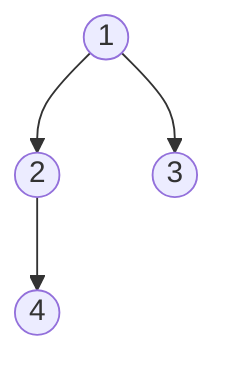

# LCA через RMQ
## 1. Эйлеров обход (Euler Tour)

Мы запускаем DFS и записываем вершину в массив **каждый раз**, когда заходим в неё или возвращаемся в неё из поддерева сына.

> [!NOTE] Примечание
> 
> В таком массиве длина будет равна $2N - 1$, так как каждое ребро проходится дважды (туда и обратно).

**Пример обхода:**

Обход: `[1, 2, 4, 2, 1, 3, 1]`

## 2. Массив глубин

Параллельно с обходом мы записываем глубины соответствующих вершин в массив `depths`.

Для примера выше:

- Вершины: `[1, 2, 4, 2, 1, 3, 1]`
    
- Глубины: `[0, 1, 2, 1, 0, 1, 0]`
    

Также нам понадобится массив `first[v]` — индекс **первого** вхождения вершины $v$ в массив обхода.

## 3. Связь с LCA

> [!INFO] **Теорема** (о связи обхода и LCA)
> 
> Пусть $u$ и $v$ — две вершины, и $first[u] < first[v]$. Тогда LCA($u, v$) — это вершина с **минимальной глубиной** на отрезке обхода от $first[u]$ до $first[v]$.

**Доказательство:**

1. При переходе от $u$ к $v$ в процессе DFS мы обязаны пройти через их общего предка.
    
2. Самая высокая точка (минимум глубины), которую мы посетим в этом промежутке, и будет их наименьшим общим предком, так как мы не можем подняться выше LCA, не закончив обход поддерева, содержащего и $u$, и $v$.

## 4. Алгоритм решения

1. Построить массив обхода и массив глубин за $O(N)$ через DFS.
    
2. Построить структуру данных для **RMQ** (обычно Sparse Table) по массиву глубин за $O(N \log N)$.
    
3. Запрос LCA($u, v$):
    
    - Найти $l = \min(first[u], first[v])$ и $r = \max(first[u], first[v])$.
        
    - Найти индекс $idx$ минимального элемента в `depths` на отрезке $[l, r]$ за $O(1)$.
        
    - Ответ: вершина, стоящая в обходе на позиции $idx$.
        

**Асимптотика**:

- **Preprocessing:** $O(N \log N)$ (построение Sparse Table).
    
- **Query:** $O(1)$ (минимум на отрезке в Sparse Table).

___
# RMQ через LCA

## Исходные данные

- Массив $A[0 \dots n-1]$ из произвольных вещественных чисел.
    
- Задача: отвечать на запросы $RMQ(A, l, r)$.

## Алгоритм сведения

**1. Построение Декартова дерева (по неявному ключу) по массиву $A$:**

Строим бинарное дерево, где для каждого узла $i$ (индекс в массиве):

- **Свойство кучи:** $A[i]$ — минимальный элемент в своём поддереве.
    
- **Свойство BST:** Все узлы в левом поддереве имеют индексы $< i$, в правом — $> i$.
    

**2. Связь RMQ и LCA:**

> [!INFO] **Теорема**
> 
> Минимум на отрезке массива $A[l \dots r]$ — это в точности вершина, являющаяся **LCA** вершин с индексами $l$ и $r$ в Декартовом дереве, построенном по этому массиву.

**Доказательство:**

1. Любой общий предок $u$ вершин $l$ и $r$ в силу свойств BST обязан иметь индекс $i \in [l, r]$.
    
2. По свойству кучи, значение в узле $u$ меньше или равно любому значению в его поддереве.
    
3. Самый глубокий из таких предков ($LCA$) будет покрывать ровно тот диапазон, который «разделяет» $l$ и $r$, что соответствует минимальному элементу на отрезке $[l, r]$.

## Асимптотика

- **Preprocessing:** $O(N)$ (построение дерева) + $O(N \log N)$ (подготовка LCA).
    
- **Query:** $O(\log N)$ (или $O(1)$, если LCA через Sparse Table).
    

> [!NOTE] Примечание
> 
> Суммарная сложность совпадает с обычным Sparse Table, но данный метод позволяет использовать свойства деревьев (например, если дерево нужно динамически перестраивать).