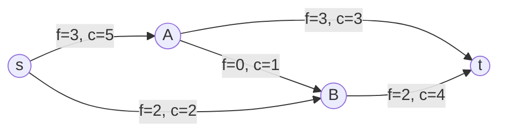

# Потоки в транспортных сетях

- **Транспортная сеть** — ориентированный граф $G = (V, E)$, в котором выделены две особые вершины: $s$ (исток), из которой поток выходит, и $t$ (сток), в которую поток входит.
    
- **Пропускная способность** $c(u, v)$ — неотрицательная функция $c: V \times V \to \mathbb{R}_{\ge 0}$, определяющая максимальное количество вещества, которое может пройти через ребро $(u, v)$ в единицу времени. Если $(u, v) \notin E$, то $c(u, v) = 0$.
    
- **Поток** $f(u, v)$ — функция $f: V \times V \to \mathbb{R}$, удовлетворяющая следующим свойствам:
    
    1. **Ограничение пропускной способности**: $\forall u, v \in V: f(u, v) \le c(u, v)$.
        
    2. **Антисимметричность**: $\forall u, v \in V: f(u, v) = -f(v, u)$.
        
    3. **Закон сохранения потока**: $\forall u \in V \setminus \{s, t\}: \sum_{v \in V} f(u, v) = 0$ (сумма втекающего потока равна сумме вытекающего).
        
- **Величина потока** $|f|$ — суммарный поток, выходящий из истока: $|f| = \sum_{v \in V} f(s, v)$.
    

---

## Остаточная сеть и дополняющие пути

- **Остаточная сеть** $G_f = (V, E_f)$ — граф, показывающий возможности дополнительной перекачки потока. Пропускная способность ребер в такой сети (остаточная пропускная способность) вычисляется как:
    
    $$c_f(u, v) = c(u, v) - f(u, v)$$
    
- **Дополняющий путь** — простой путь из $s$ в $t$ в остаточной сети $G_f$, состоящий только из ребер с $c_f(u, v) > 0$.