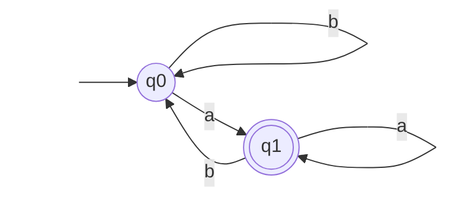
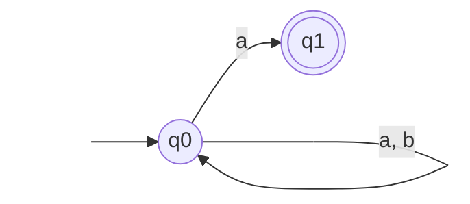

Это графический способ представления конечного автомата (ДКА или НКА) в виде ориентированного графа.

---

### Основные правила построения

- **Вершины графа** — соответствуют множеству состояний автомата $Q$.
    
- **Направленные дуги (стрелки)** — соответствуют функции переходов $\delta$. Если при считывании символа $a$ автомат переходит из состояния $q_1$ в $q_2$, рисуется стрелка $q_1 \xrightarrow{a} q_2$.
    
- **Начальное состояние ($q_0$)** — помечается «входящей» стрелкой из пустоты.
    
- **Принимающие состояния ($Q_f$)** — выделяются **двойной обводкой** (двойным кружком).
    

---

>[!EXAMPLE] **Пример**
>Возьмем регулярное выражение **$(a+b)^*a$**. Оно описывает все слова из букв $a$ и $b$, которые **заканчиваются на $a$**.

**ДКА**

**НКА**

