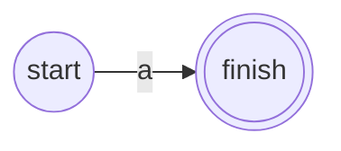
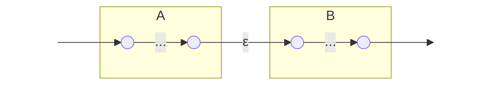
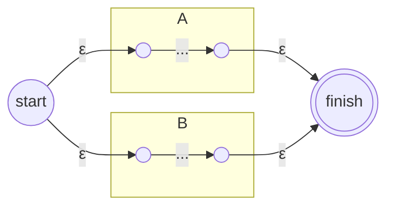
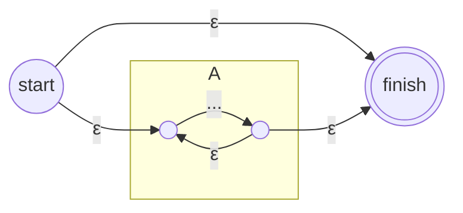
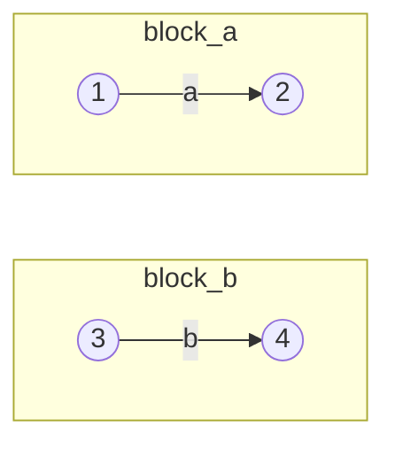
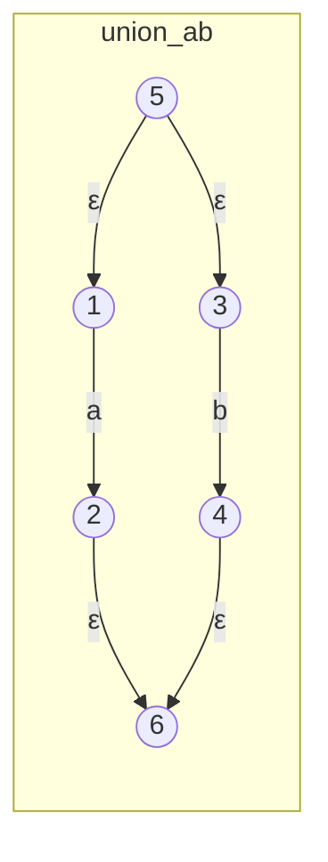
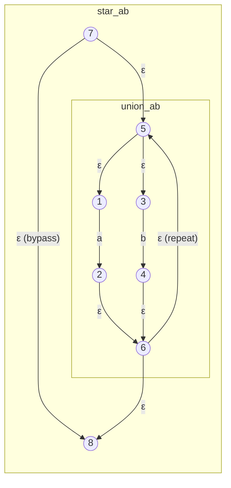
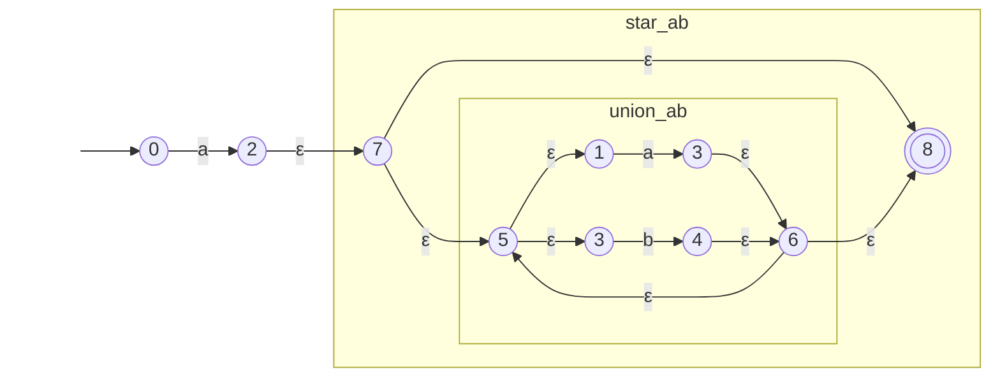

Позволяет рекурсивно собрать НКА для любого регулярного выражения.

**Базовые элементы:**

- **Символ $a$:**

- **Пустое слово $\varepsilon$:**
    

**Операции:**

- **Конкатенация $AB$:**
    

_(Финиш А соединяется со стартом В)_

- **Объединение $A + B$:**

- **Итерация $A^*$ (Звезда Клини):**

___

### **Пример**
$$a (a + b)^*$$

#### Шаг 1: Базис для символов $a$ и $b$

Сначала создаем простейшие автоматы для каждой буквы.

#### Шаг 2: Объединение $(a+b)$

Соединяем блоки $a$ и $b$ через $\varepsilon$-переходы, добавляя новые старт и финиш.

#### Шаг 3: Итерация $(a+b)^*$ (Звезда Клини)

Оборачиваем полученный блок объединения по схеме итерации. Добавляем петлю возврата ($\varepsilon$) и обходной путь ($\varepsilon$).

#### Шаг 4: Конкатенация $a \cdot (a+b)^*$ (Итоговый автомат)

Берем еще один базовый блок $a$ и соединяем его $\varepsilon$-переходом со стартом блока $(a|b)^*$. Состояние 8 становится единственным принимающим.

