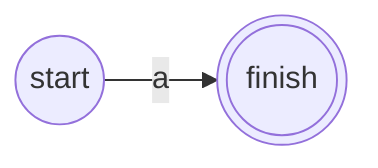
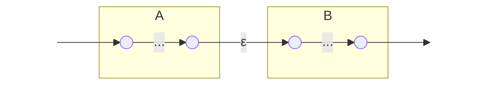
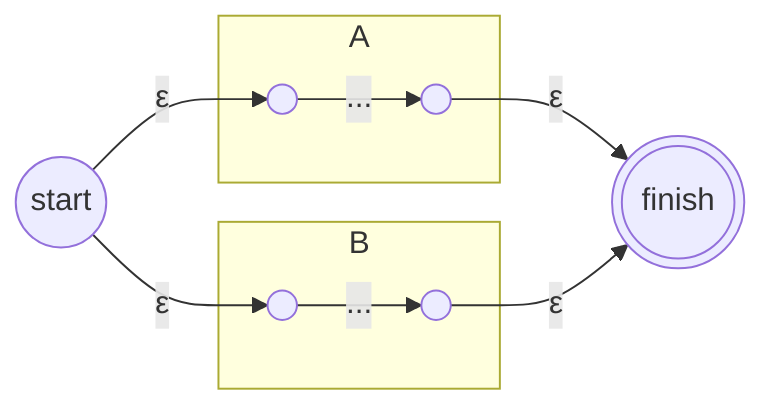
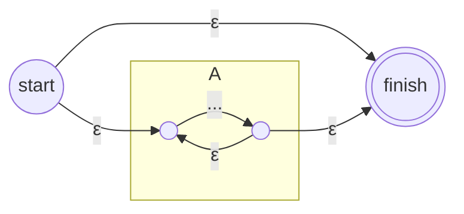

Позволяет рекурсивно собрать НКА для любого регулярного выражения.

**Базовые элементы:**

- **Символ $a$:**



- **Пустое слово $\varepsilon$:**
    


**Операции:**

- **Конкатенация $AB$:**
    



_(Финиш А соединяется со стартом В)_

- **Объединение $A + B$:**



- **Итерация $A^*$ (Звезда Клини):**



___

>[!EXAMPLE] **Пример**
>Регулярное выражение: $a(a + b)^*$
> ```mermaid
> graph TD
>     direction LR
>     Start[ ] --> s0
>     
>     s0(( )) -- a --> f0(( ))
>     f0 -- ε --> S_s(( ))
>     
>     subgraph star_ab
>     S_s -- ε --> S_u(( ))
>     S_s -- ε --> F_s((( )))
>     
>     subgraph union_ab
>     S_u -- ε --> s1(( ))
>     S_u -- ε --> s2(( ))
>     s1 -- a --> f1(( ))
>     s2 -- b --> f2(( ))
>     f1 -- ε --> F_u(( ))
>     f2 -- ε --> F_u
>     end
>     
>     F_u -- ε --> S_u
>     F_u -- ε --> F_s
>     end
>     style Start fill:none,stroke:none
> ```
