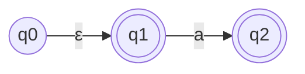
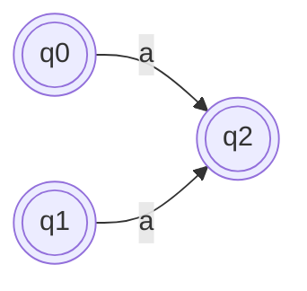

> [!TIP] **Суть**
> 
> Мы заменяем цепочку $q \xrightarrow{\varepsilon\dots\varepsilon} p \xrightarrow{a} r$ одним прямым переходом $q \xrightarrow{a} r$.

**Алгоритм:**

1. Для каждого состояния $q$ вычислить $\varepsilon$-замыкание $Cl_{\varepsilon}(q)$ 
	(все состояния, достижимые по $\varepsilon$: $q \xrightarrow{\varepsilon} q, q \xrightarrow{\varepsilon}p, q \xrightarrow{\varepsilon}p \xrightarrow{\varepsilon} r \Rightarrow \{ q, p, r \} \subset Cl_{\epsilon}$).
    
2. Добавить переход $q \xrightarrow{a} r$, если существует $p \in Cl_{\varepsilon}(q)$ такое, что $p \xrightarrow{a} r$.
    
3. Сделать $q$ принимающим, если в $Cl_{\varepsilon}(q)$ есть хотя бы одно старое принимающее состояние.
    
4. Удалить все $\varepsilon$-переходы.
    

**Пример:**

_До удаления:_

_$\varepsilon$-замыкания:_ $Cl_{\varepsilon}(q_0) = \{q_0, q_1\}$, $Cl_{\varepsilon}(q_1) = \{q_1\}$.

_После удаления:_

