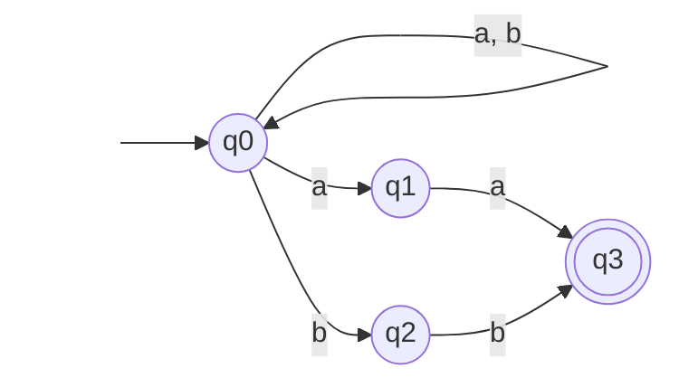
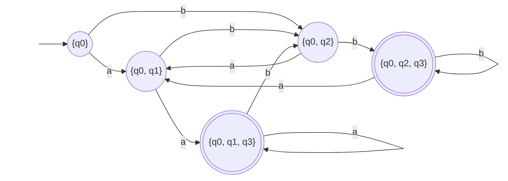

#### Шаг 1: Создание начального состояния

Начальное состояние нашего нового ДКА — это множество, состоящее только из начального состояния НКА: $Q_{new\_start} = \{q_0\}$.

_(Помечаем его как «необработанное»)_.

#### Шаг 2: Итеративное построение переходов

Пока есть «необработанные» множества $P$ (изначально это $\{ q_{0} \}$):

1. Берем множество $P$, добавляем в таблицу $T$ .
    
2. Для каждого символа $a \in \Sigma$:
    
    - Смотрим, куда можно попасть из **всех** состояний, что есть в $P$, по букве $a$.
        
    - Формируем новое множество $U = \bigcup_{p \in P} \delta(p, a)$.
        
    - Если $U$ не равно ни одному из множеств $\in T$, добавляем его в список «необработанных».
        
    - Рисуем стрелку из $P$ в $U$ по букве $a$.
        
3. Помечаем $P$ как «обработанное».
    

#### Шаг 3: Определение финальных состояний

Любое состояние ДКА (множество), в котором содержится **хотя бы одно** финальное состояние из исходного НКА, становится принимающим.

---

## Пример

Допустим, мы уже удалили $\varepsilon$-переходы и получили такой НКА для языка, где есть подстрока `aa` или `bb`:

#### Пошаговая таблица построения (Трассировка):

| **Состояние ДКА (множество НКА)** | **Символ 'a'**             | **Символ 'b'**           |
| --------------------------------- | -------------------------- | ------------------------ |
| **A: {q0}**                       | {q0, q1} $\to$ **B**       | {q0, q2} $\to$ **C**     |
| **B: {q0, q1}**                   | {q0, q1, q3} $\to$ **D* ** | {q0, q2} $\to$ **C**     |
| **C: {q0, q2}**                   | {q0, q1} $\to$ **B**       | {q0, q2, q3} $\to$ **E** |
| **D*: {q0, q1, q3}**              | {q0, q1, q3} $\to$ **D* ** | {q0, q2} $\to$ **C**     |
| **E*: {q0, q2, q3}**              | {q0, q1} $\to$ **B**       | {q0, q2, q3} $\to$ **E** |

_Звездочкой помечены принимающие, так как в них входит $q_3$._

### Итоговый ДКА 

Теперь рисуем граф на основе таблицы. Каждая строка — это один «кружочек» нашего нового детерминированного автомата.

