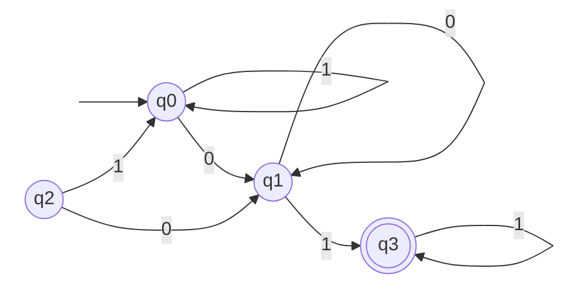
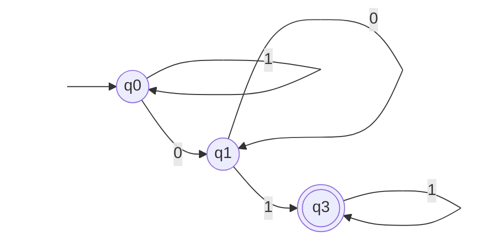

## Алгоритм:

1. **Старт:** Делим все состояния на две группы: $\Pi = \{ G_1, G_2 \}$, где $G_1 = Q \setminus Q_f$ (нефинальные), а $G_2 = Q_f$ (финальные).
    
2. **Дробление:** Для каждой группы $G$ проверяем состояния $u, v \in G$. Они остаются в одной подгруппе, если для любого символа $a$ их переходы $\delta(u, a)$ и $\delta(v, a)$ попадают в **одну и ту же группу** текущего разбиения $\Pi$.
    
3. **Цикл:** Если после проверки всех групп появилось новое разбиение $\Pi_{new} \neq \Pi$, берём его за основу и повторяем Шаг 2.
    
4. **Сборка:** Каждая итоговая группа становится одним состоянием в новом автомате. Удаляем недостижимые состояния

---

## Пример 

Пусть есть ПДКА с алфавитом $\{0, 1\}$.

- Нефинальные: $q_0, q_1, q_2$
    
- Финальные: $q_3$
    

**Исходный ПДКА:**

#### **Шаг 1: Начальное разбиение $\Pi$**

- $G_1$ (нефинальные): $\{q_0, q_1, q_2\}$
    
- $G_2$ (финальные): $\{q_3\}$
    
    $\Pi = \{ G_1, G_2 \}$
    

#### **Шаг 2: Дробление $G_1$**

Проверяем, куда ведут переходы относительно групп $G_1$ и $G_2$:

|**Состояние**|**по 0**|**Класс**|**по 1**|**Класс**|**Сигнатура**|
|---|---|---|---|---|---|
|**$q_0$**|$q_1$|$G_1$|$q_0$|$G_1$|**$(G_1, G_1)$**|
|**$q_1$**|$q_1$|$G_1$|$q_3$|$G_2$|**$(G_1, G_2)$**|
|**$q_2$**|$q_1$|$G_1$|$q_0$|$G_1$|**$(G_1, G_1)$**|

**Результат:** 

1. $q_0$ и $q_2$ имеют одинаковую сигнатуру $(G_1, G_1)$. Они «склеиваются» в одну группу.
2. $q_1$ имеет другую сигнатуру $(G_1, G_2)$. Оно отделяется.

Новое разбиение: $\Pi_{new} = \{ \{q_0, q_2\}, \{q_1\}, \{q_3\} \}$.

### Шаг 3. Проверка условия выхода

Сравниваем $\Pi_{new}$ и $\Pi$. Они не равны. **Повторяем Шаг 2** для нового разбиения.

### Шаг 4. Вторая итерация дробления

Теперь проверяем группу $\{q_0, q_2\}$ относительно _нового_ состава групп $G_A:\{q_0, q_2\}, G_B:\{q_1\}, G_C:\{q_3\}$):

- $q_0 \xrightarrow{0} q_1 \in \mathbf{G_B}$
    
- $q_2 \xrightarrow{0} q_1 \in \mathbf{G_B}$

- $q_0 \xrightarrow{1} q_0 \in \mathbf{G_A}$
    
- $q_2 \xrightarrow{1} q_0 \in \mathbf{G_A}$
    

**Итог:** Сигнатуры $q_0$ и $q_2$ полностью совпали $(G_B, G_A)$. Группа $\{q_0, q_2\}$ **не дробится**.

#### **Шаг 5: Сборка**

Теперь смотрим на получившиеся группы:

- Группа $\{q_0, q_2\}$ содержит начальное состояние $q_0$.
    
- Группа $\{q_1\}$ достижима из $q_0$ по символу `0`.
    
- Группа $\{q_3\}$ достижима из $q_1$ по символу `1`.

## **Минимальный ПДКА**

Поскольку $q_2$ недостижимо, оно не влияет на язык. Мы его просто игнорируем при сборке.

