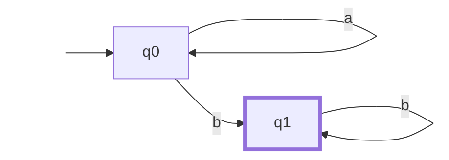

Для нахождения регулярного выражения по заданному автомату строится система линейных уравнений, где в качестве переменных выступают правые языки состояний (обозначим их как $X_i$).

Система уравнений имеет следующий вид:

$$\begin{cases} X_1 = \alpha_{11}X_1 + \dots + \alpha_{1n}X_n + \beta_1 \\ \dots \\ X_n = \alpha_{n1}X_1 + \dots + \alpha_{nn}X_n + \beta_n \end{cases}$$

Здесь $X_i$ — переменные множества, $\alpha_{ij}$ — это регулярное выражение, написанное на стрелке, которая ведет из состояния $q_i$ в состояние $q_j$, и $\beta_i$ — это показатель того, является ли состояние принимающим (если да, то $\beta_i = \varepsilon$, иначе $\beta_i = \emptyset$). 

Решением называется набор языков $A_1, \dots, A_n$ такой, что для любого другого набора языков $B_1, \dots, B_n$, удовлетворяющего системе, выполнено $A_i \subseteq B_i$ (то есть решение является минимальным по включению набором).

### Алгоритм решения системы

Разберём случаи при решении системы:

#### Случай 1

Если в системе есть строка вида:

$$X_i = \alpha_{ii}X_i + \gamma, \quad \alpha_{ii} \neq \emptyset$$

то заменим всюду $X_i$ на $\alpha_{ii}^*\gamma$, а саму исходную строку удалим.

> [!NOTE] Обоснование корректности (Лемма Ардена)
> 
> Попробуем чисто логически раскрутить это уравнение, подставляя его само в себя:
> 
> - **Шаг 1:** $X_i = \alpha_{ii}X_i + \gamma$
>     
> - **Шаг 2:** $X_i = \alpha_{ii}(\alpha_{ii}X_i + \gamma) + \gamma = \alpha_{ii}\alpha_{ii}X_i + \alpha_{ii}\gamma + \gamma$
>     
> - **Шаг 3:** $X_i = \alpha_{ii}\alpha_{ii}\alpha_{ii}X_i + \alpha_{ii}\alpha_{ii}\gamma + \alpha_{ii}\gamma + \gamma$
>     
> 
> Получающаяся бесконечная последовательность $\dots + \alpha_{ii}\alpha_{ii}\gamma + \alpha_{ii}\gamma + \gamma$ в точности соответствует определению звезды Клини. Таким образом, уравнение вида $X = aX + b$ имеет минимальное решение $X = a^*b$.

#### Случай 2

Если в системе нет строк, подходящих под первый случай, это означает, что переменная $X_n$ не встречается в правой части $n$-ой строки (отсутствует саморекурсия). В этом случае заменим всюду $X_n$ на правую часть этой строки во всех остальных уравнениях системы, а саму $n$-ую строку удалим.

> [!NOTE] Обоснование корректности
> 
> Раз случай 1 не подошел, значит, в строчке для $X_n$ нет саморекурсии. После того как мы подставим правую часть $n$-ой строки вместо переменной $X_n$ во все остальные уравнения, переменная $X_n$ полностью исчезнет из оставшейся части системы. По сути, мы просто последовательно решаем систему уравнений методом исключения переменных.

___

### Полный пример применения метода

Пусть дан НКА, принимающий слова, где после любого количества букв `a` обязательно идет хотя бы одна буква `b` (язык $a^*b^+$).

#### Граф автомата

_Переменная $X_0$ отвечает за состояние $q_0$ (оно стартовое), а $X_1$ — за состояние $q_1$ (оно финальное, выделено жирным)._

#### Шаг 1: Составление системы уравнений

Смотрим на переходы из каждого состояния:

- Из $q_0$ есть петля по `a` в $q_0$ и стрелка по `b` в $q_1$. Состояние не финальное.
    
- Из $q_1$ есть петля по `b` в $q_1$. Состояние **финальное**, поэтому добавляем $+\varepsilon$.
    

$$\begin{cases} X_0 = aX_0 + bX_1 \\ X_1 = bX_1 + \varepsilon \end{cases}$$

#### Шаг 2: Решение системы по алгоритму

**1. Работаем со второй строкой (Случай 1):**

Уравнение имеет рекурсивный вид $X_1 = bX_1 + \varepsilon$.

По правилу Случая 1 ($X = aX + b \implies X = a^*b$), заменяем его на:

$$X_1 = b^*\varepsilon = b^*$$

Саму строку для $X_1$ временно убираем, запомнив значение.

**2. Подставляем $X_1$ в первую строку (Случай 2):**

Подставим найденное $X_1 = b^*$ в первое уравнение:

$$X_0 = aX_0 + b(b^*) = aX_0 + b^+$$

**3. Финальный аккорд (Случай 1 для $X_0$):**

Получили уравнение $X_0 = aX_0 + b^+$. Снова применяем правило Случая 1:

$$X_0 = a^*(b^+) = a^*b^+$$

#### Итог

Так как стартовым состоянием автомата было $q_0$, то значение переменной $X_0$ и является искомым регулярным выражением для всего автомата.

**Ответ:** $a^*b^+$