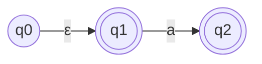
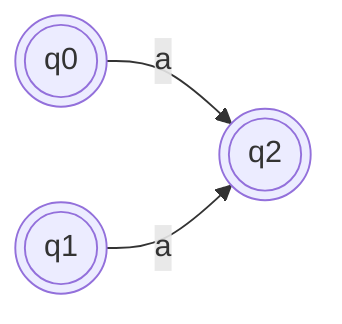
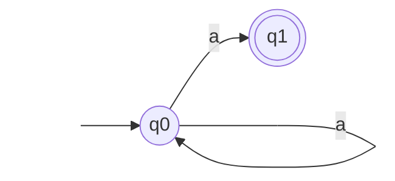

## 2. Удаление $\varepsilon$-переходов

> [!TIP] **Суть**
> 
> Мы заменяем цепочку $q \xrightarrow{\varepsilon\dots\varepsilon} p \xrightarrow{a} r$ одним прямым переходом $q \xrightarrow{a} r$.

**Алгоритм:**

1. Для каждого состояния $q$ вычислить $\varepsilon$-замыкание $Cl_{\varepsilon}(q)$ (все состояния, достижимые по $\varepsilon$).
    
2. Добавить переход $q \xrightarrow{a} r$, если существует $p \in Cl_{\varepsilon}(q)$ такое, что $p \xrightarrow{a} r$.
    
3. Сделать $q$ принимающим, если в $Cl_{\varepsilon}(q)$ есть хотя бы одно старое принимающее состояние.
    
4. Удалить все $\varepsilon$-переходы.
    

**Пример:**

_До удаления:_



_$\varepsilon$-замыкания:_ $Cl_{\varepsilon}(q_0) = \{q_0, q_1\}$, $Cl_{\varepsilon}(q_1) = \{q_1\}$.

_После удаления:_



_(q0 стало принимающим, так как Cl(q0) содержало принимающее q1)_

---

## 3. Преобразование НКА в ДКА

> [!INFO]
> 
> Состояния ДКА — это **множества** состояний НКА.

**Алгоритм:**

1. **Начальное состояние ДКА:** $\varepsilon$-замыкание начального состояния НКА $\{q_0\}$.
    
2. **Для каждого нового множества $P$ и каждой буквы $a$:**
    
    - Найти все состояния НКА, достижимые из $P$ по букве $a$: $U = \bigcup_{p \in P} \delta(p, a)$.
        
    - Множество $Cl_{\varepsilon}(U)$ становится новым состоянием ДКА.
        
3. **Принимающие состояния ДКА:** Множества, содержащие хотя бы одно принимающее состояние исходного НКА.
    

**Пример:**

_Исходный НКА:_



_Преобразование (таблица):_

| **Состояние ДКА (множество)** | **Ввод 'a'**                                                                            | **Ввод 'b'** |
| ----------------------------- | --------------------------------------------------------------------------------------- | ------------ |
| **A:** $\{q0\}$               | $\delta(q0, a) = \{q0, q1\}$ $\to$ **B**                                                | $\emptyset$  |
| **B*:** $\{q0, q1\}$          | $\delta(q0, a) \cup \delta(q1, a) = \{q0, q1\} \cup \emptyset = \{q0, q1\}$ $\to$ **B** | $\emptyset$  |

_Полученный ДКА:_

```mermaid
graph LR
    Start[ ] --> A
    A(( {q0} )) -- a --> B
    B((( {q0,q1} ))) -- a --> B
    style Start fill:none,stroke:none
```

---

## 4. Минимизация ПДКА (Алгоритм Хопкрофта)

> [!TIP]
> 
> Мы склеиваем состояния, которые **невозможно различить** ни одним суффиксом.

**Алгоритм:**

1. Разбить состояния на два класса: принимающие ($C_{acc}$) и непринимающие ($C_{rej}$).
    
2. Для каждого класса и каждой буквы проверить, переходят ли состояния класса в разные классы. Если да — разбить класс.
    
3. Повторять п. 2, пока классы не перестанут дробиться.
    

**Пример:**

_Исходный ПДКА:_

Code snippet

```
graph LR
    Start[ ] --> q0
    q0((q0)) -- 0 --> q1
    q0 -- 1 --> q3
    q1((q1)) -- 0 --> q0
    q1 -- 1 --> q2
    q2(((q2))) -- 0 --> q2
    q2 -- 1 --> q2
    q3(((q3))) -- 0 --> q3
    q3 -- 1 --> q3
    style Start fill:none,stroke:none
```

**Итерации минимизации:**

1. $C_1 = \{q_2, q_3\}$ (принимающие), $C_2 = \{q_0, q_1\}$ (непринимающие).
    
2. Проверяем $C_1$: из $q_2$ и $q_3$ по 0 и 1 мы остаемся в $C_1$. Класс $C_1$ **не дробится**.
    
3. Проверяем $C_2$:
    
    - Из $q_0$ по 1 $\to q_3 \in C_1$.
        
    - Из $q_1$ по 1 $\to q_2 \in C_1$.
        
    - Оба ведут в один класс. Аналогично для 0. Класс $C_2$ **не дробится**.
        
4. **Итог:** склеиваем $q_2$ с $q_3$, а $q_0$ с $q_1$.
    

_Минимальный ПДКА:_

Code snippet

```
graph LR
    Start[ ] --> Q01
    Q01(( q0,q1 )) -- 0 --> Q01
    Q01 -- 1 --> Q23
    Q23((( q2,q3 ))) -- 0 --> Q23
    Q23 -- 1 --> Q23
    style Start fill:none,stroke:none
```