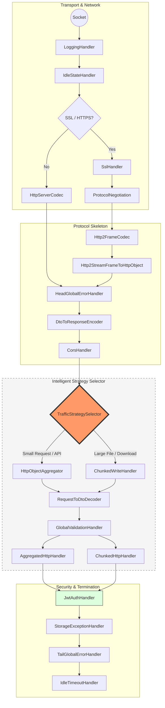

```mermaid
graph TD
    %% Уровни обработки
    subgraph Layer1 [Transport & Network]
        Start((Socket)) --> Logging[LoggingHandler]
        Logging --> Idle[IdleStateHandler]
        Idle --> SSL{SSL / HTTPS?}
        SSL -- Yes --> SslHandler[SslHandler]
        SslHandler --> ALPN[ProtocolNegotiation]
        SSL -- No --> HTTP1[HttpServerCodec]
    end

    subgraph Layer2 [Protocol Skeleton]
        ALPN --> HTTP2[Http2FrameCodec]
        HTTP2 --> H2ToH1[Http2StreamFrameToHttpObject]
        HTTP1 --> ErrorHead[HeadGlobalErrorHandler]
        H2ToH1 --> ErrorHead
        
        ErrorHead --> Encoder[DtoToResponseEncoder]
        Encoder --> Cors[CorsHandler]
    end

    subgraph Layer3 [Intelligent Strategy Selector]
        Cors --> Selector{TrafficStrategySelector}
        
        %% Ветка агрегации
        Selector -- "Small Request / API" --> Aggregator[HttpObjectAggregator]
        Aggregator --> DtoDec[RequestToDtoDecoder]
        DtoDec --> Valid[GlobalValidationHandler]
        Valid --> AggHandler[AggregatedHttpHandler]
        
        %% Ветка чанков
        Selector -- "Large File / Download" --> ChunkedWrite[ChunkedWriteHandler]
        ChunkedWrite --> DtoDec
        Valid --> ChunkHandler[ChunkedHttpHandler]
    end

    subgraph Layer4 [Security & Termination]
        AggHandler --> Auth[JwtAuthHandler]
        ChunkHandler --> Auth
        Auth --> StorageEx[StorageExceptionHandler]
        StorageEx --> ErrorTail[TailGlobalErrorHandler]
        ErrorTail --> IdleTO[IdleTimeoutHandler]
    end

    %% Стилизация
    style Selector fill:#f96,stroke:#333,stroke-width:4px
    style Layer3 fill:#f5f5f5,stroke:#666,stroke-dasharray: 5 5
    style Auth fill:#dfd,stroke:#333
```