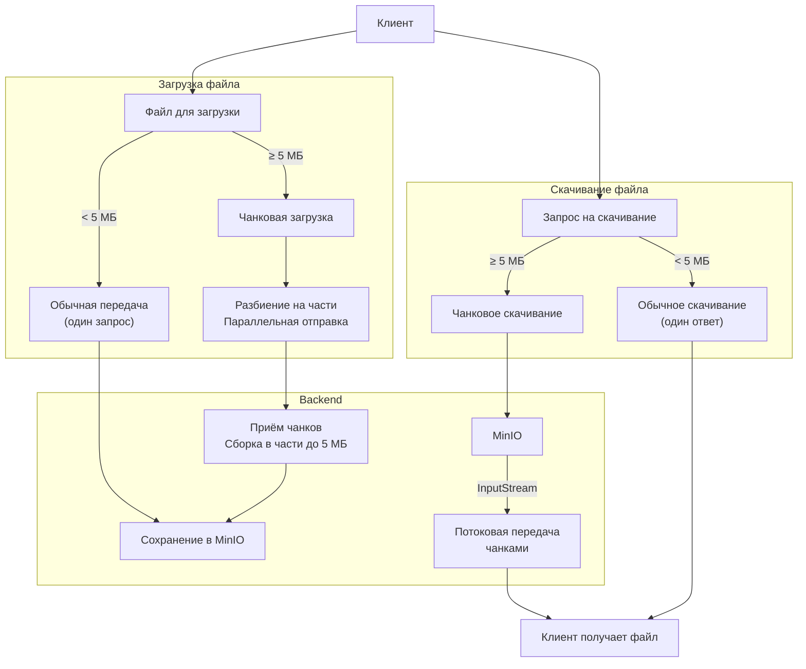

___

#### Контрольные суммы

Используем `MD-5` (быстрый, коллизии не страшны)

- `StorageEntity` хранит `checksum` на будущее, например, от `Bit Rot` (повреждения данных) или для сверки клиента с пришедшим файлом (приходит при старте загрузки)
- Клиент отправляет чексумму для каждой части `5 MB` в хедере `Digest: md5=...`
- Сервер сравнивает его с тем, что получил из `MessageDigest` (через репозиторий)
- Если хэши не совпадают, отправляем ответ о ретрае клиенту
- Делаем двойную проверку: `Наш_MD_5_части == ETag_части_из_MinIO`
- В конце загрузки сверяем полученный `MD5` всего файла с `checksum` у `entity`

Проблема: 
- При текущей логике загрузки (HttpRequest -> HttpContent -> LastHttpContent) клиенту либо придется **считать хеш всего файла перед отправкой** (очень долго), либо **менять структуру** `HttpContent` (`[размер хэша][хэш][5МБ данных]`), что сложнее и менее надежно

Значит, переходим на новую архитектуру чанковой загрузки:
- Одна часть `5 МБ` = Один HTTP запрос (`/upload/chunked?sessionId=...&path=...`)
- Юзеру даем `sessionId` (ведь на каждый запрос свое tcp соединение, в канале хранить не получится)
- Храним состояние загрузки в БД для большей отказоустойчивости. Собираем чанки и кладём их в аттрибуты канала в `CompositeByteBuf` (чтобы после его смерти они очищались), в них же - sessionId
- Теперь при ретрае вместо остановки всей загрузки просто помечаем его как битый и в конце смотрит, доотправил ли его клиент
- Меняем `maxAggregatedContentLength` (5МБ овердофига, если много параллельных загрузок)
- Переделываем `ChunkedHttpHandler`: теперь контекст - это не вся загрузка, а только один ее запрос. 

Кроме возможностей хэширования это нам даёт:
- Параллелизм
- Более простую логику восстановления (к примеру, клиенту не нужно рассчитывать смещение текущей части)
- Zero-copy
- Упрощение бизнес-логики: никакого тяжелого сбора чанков в части

```java
public class StreamCleanupHandler extends ChannelInboundHandlerAdapter {
    @Override
    public void channelInactive(ChannelHandlerContext ctx) {
        // Стрим закрылся - проверяем, не забыли ли мы чего
        CompositeByteBuf buf = ctx.channel().attr(NettyAttributes.CHUNK_ACCUMULATOR).get();
        if (buf != null && buf.refCnt() > 0) {
            buf.release(); // Освобождаем память
        }
        ctx.fireChannelInactive();
    }
}
```