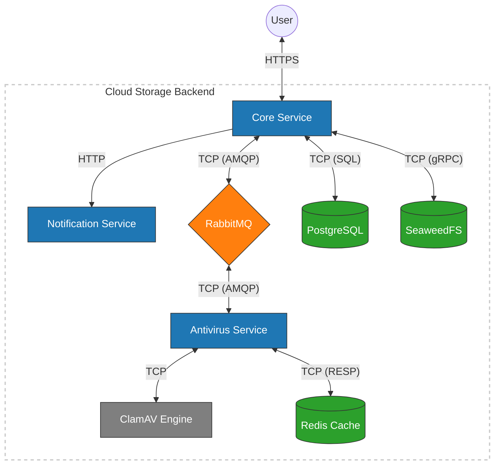

```mermaid
graph TD
    %% Узел пользователя
    User((User))

    subgraph System ["Cloud Storage Backendᅠᅠᅠᅠᅠᅠᅠᅠᅠᅠᅠᅠᅠᅠᅠᅠᅠᅠ"]
        %% Сервисы
        Core[Core Service]
        AV[Antivirus Service]
        Notify[Notification Service]
        
        %% Движок
        Clam[ClamAV Engine]

        %% Инфраструктура
        Rabbit{RabbitMQ}
        Redis[(Redis Cache)]
        
        %% Хранилища
        DB[(PostgreSQL)]
        S3[(SeaweedFS)]
    end

    %% Связи
    User <-- HTTPS --> Core
    
    Core <-- "TCP (SQL)" --> DB
    Core <-- "TCP (gRPC)" --> S3
    Core -- HTTP --> Notify
    
    %% Двунаправленные очереди (объединяем стрелки)
    Core <-- "TCP (AMQP)" --> Rabbit
    Rabbit <-- "TCP (AMQP)" --> AV
    
    %% Внутрянка антивируса
    AV <-- "TCP (RESP)" --> Redis
    AV <-- TCP --> Clam

    %% Стилизация
    style System fill:none,stroke:#ccc,stroke-width:2px,stroke-dasharray: 5 5
    style Core fill:#1f77b4,color:#fff,stroke:#333
    style AV fill:#1f77b4,color:#fff,stroke:#333
    style Notify fill:#1f77b4,color:#fff,stroke:#333
    style Rabbit fill:#ff7f0e,color:#fff,stroke:#333
    style Redis fill:#2ca02c,color:#fff,stroke:#333
    style DB fill:#2ca02c,color:#fff,stroke:#333
    style S3 fill:#2ca02c,color:#fff,stroke:#333
    style Clam fill:#7f7f7f,color:#fff,stroke:#333
```

___
