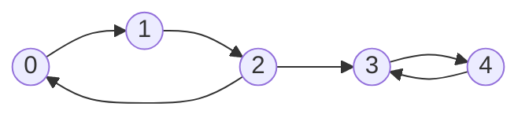
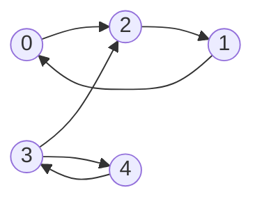

**Конденсированный граф** — граф, получаемый из орграфа, сжатием компонент сильной связности в одну вершину

![[Pasted image 20260214140853.png]]

___
### Алгоритм Косарайю
Предназначен для поиска компонент сильной связности в орграфе

1. **Прямой обход $DFS$ и построение топологического порядка**
	Когда $DFS$ выходит из вершины, мы добавляем её в список (стек) `orders`
2. **Транспонирование рёбер**
	Создаём новый граф, где каждое ребро $u \to v$ заменяется на $v \to u$.
3. **Обратный обход $DFS$**
	Берём вершины из нашего списка `orders` в обратном порядке (с конца) и запускаем $DFS$ по транспонированному графу

#### Пример



- **Компонента 1:** 0, 1, 2 ($0 \to 1 \to 2 \to 0$)
- **Компонента 2:** 3, 4 ($3 \to 4 \to 3$)

**Шаг 1:** Запускаем DFS от вершины $0$: `orders = [4, 3, 2, 1, 0]`
**Шаг 2**: Разворачиваем все стрелки. Теперь компоненты внутри остались связными, но мост между ними теперь ведет из **3 в 2**.



**Шаг 3:** Обратный DFS
- **Запуск из 0:**
    
    - Посещаем 0, идем по стрелкам: $0 \to 2 \to 1$.
        
    - Все, тупик (в 3 зайти нельзя, стрелка $3 \to 2$ мешает).
        
    - **SCC 1:** `{0, 1, 2}`.
        
- **Запуск из 1 и 2:** Пропускаем, так как `mark[1]` и `mark[2]` уже истинны.
    
- **Запуск из 3:**
    
    - Посещаем 3, идем в 4.
        
    - Из 4 в 3 (уже посещена), из 3 в 2 (уже посещена).
        
    - **SCC 2:** `{3, 4}`.
        
- **Запуск из 4:** Пропускаем.

#### 

#### Код

```cpp
void dfs1(int v) {
    visited[v] = true;
    for (int to : g[v])
        if (!visited[to]) dfs1(to);
    orders.push_back(v);
}

void dfs2(int v) {
    visited[v] = true;
    component.push_back(v);
    for (int to : gr[v])
        if (!visited[to]) dfs2(to);
}

int main() {
    ...
    for (int v : orders) {
        if (!visited[v]) {
            component.clear();
            dfs2(v);
            components.push_back(component);
        }
    }
}
```

 **Асимптотика:** $O(|V| + |E|)$

___

#### 2-SAT
...

$(x \lor y ) \land (!x \lor z) \land (!z \lor y) = 1$

$(x \lor y) \iff (\bar{x} \to y) \iff (\bar{y} \to x)$
$(!x \lor z) \iff (x \to z) \iff (\bar{z} \to \bar{x})$
$(\bar{z} \lor y) \iff (z \to y) \iff (\bar{y} \to \bar{z})$

1. По стрелкам импликации строим граф
2. Находим компоненты сильной связности, получаем массив с ними $idx$ в топ. порядке
3. Если в одной компоненте есть $x_{i}$ и $\bar{x}_{i}$, то решения нет
4. Если $idx(x) > idx(\bar{x})$, то $x = 1$, иначе $x = 0$


