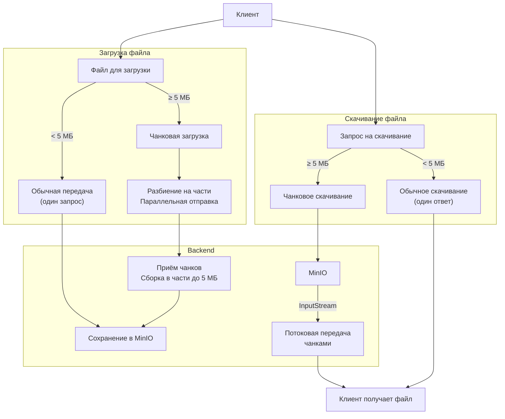

```mermaid
graph TD
	A1[Клиент] --> B1[Файл для загрузки];
	
	subgraph Upload["Загрузка файла"]
	    B1 -- "< 5 МБ" --> D1["Обычная передача<br>(один запрос)"];
	    B1 -- "≥ 5 МБ" --> E1["Чанковая загрузка"];
	    
	    E1 --> H1["Разбиение на части<br>Параллельная отправка"];
    end
    
    subgraph Backend["Backend"]
	    H1 --> J1["Приём чанков<br>Сборка в части до 5 МБ"];
	    J1 --> K1["Сохранение в MinIO"];
	    D1 --> K1;
    end 
    
    A1 --> B2["Запрос на скачивание"];
    
    subgraph Download["Скачивание файла"]
	    B2 -- "< 5 МБ" --> D2["Обычное скачивание<br>(один ответ)"];
	    B2 -- "≥ 5 МБ" --> E2["Чанковое скачивание"];
    end
    
    subgraph Backend
	    E2 --> G2["MinIO"];
	    G2 -->|InputStream| H2["Потоковая передача<br>чанками"];
    end
    
    D2 --> P2["Клиент получает файл"]
    H2 --> P2
```